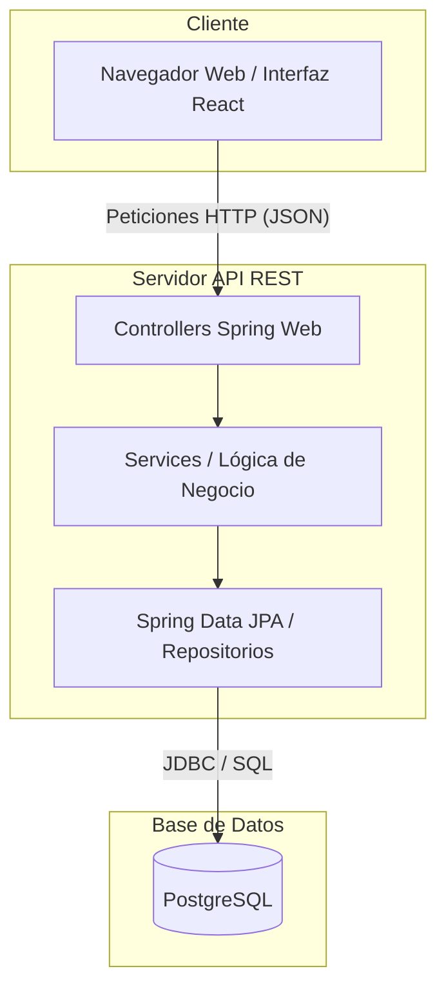

# Note Challenge - Full Stack App 📝

Este repositorio contiene una aplicación web completa (Full Stack) diseñada para **crear, organizar, archivar y clasificar notas**. Está separada en dos entornos distintos que se comunican entre sí para proveer una solución end-to-end ágil y persistente.

---

## 🏗️ Arquitectura del Proyecto

El sistema está diseñado utilizando una arquitectura clásica **Cliente-Servidor (Frontend-Backend)** con un patrón multicapas para separar la lógica de negocio, de la interfaz visual y la persistencia de datos.

### ¿Qué se está haciendo a grandes rasgos?

1. **Frontend:** El usuario interactúa con la interfaz gráfica web en tiempo real. Todas sus acciones de click (crear, borrar, acomodar) se traducen en peticiones estándar del protocolo HTTP (GET, POST, PUT, DELETE).
2. **Backend:** El servidor Java recibe estas peticiones a través de sus controladores (`Controllers`). Valida quién está haciendo la petición usando un identificador (`X-User-Id`), ejecuta la lógica de negocio pertinente y traduce esa orden de Java a SQL.
3. **Base de Datos:** Recibe la orden en SQL, modifica la información almacenada en el disco duro y se la devuelve confirmada al backend, que finaliza la cadena notificando a React para que actualice la vista al usuario.

---

## 🛠️ Tecnologías Utilizadas

La solución está apoyada en tecnologías modernas y líderes en la industria:

### 🎨 Entorno Frontend (`/frontend`)
*   **React:** Librería principal para construir la Interfaz de Usuario mediante componentes reutilizables.
*   **Gestor de Dependencias NPM:** Usado para instalar complementos que agilizan el desarrollo de Vistas y Estilos.
*   **AJAX / Fetch API:** Utilizados tras bambalinas para realizar los llamados asincrónicos al servidor sin recargar la página.

### ⚙️ Entorno Backend (`/backend`)
*   **Java 21:** Versión reciente y poderosa de Java aprovechando su alto rendimiento.
*   **Spring Boot 4.x:** Framework estrella de Java que provee un servidor web (Tomcat) autoconfigurado.
*   **Spring Data JPA:** Capa de abstracción encargada del ORM (Object-Relational Mapping), que evita escribir SQL directo, permitiendo usar Clases para representar Tablas.
*   **Lombok:** Extensión útil para evitar escribir constructores y Getters/Setters verbosos (código boilerplate).
*   **Maven:** Herramienta de gestión y construcción que automatiza todas las descargas de bibliotecas.

### 🗄️ Persistencia 
*   **PostgreSQL:** Uno de los motores relacionales de base de datos Open Source más robustos y potentes del mundo.
*   **Hibernate:** Entrenado mediante Spring Boot para actualizar las tablas de SQL (`ddl-auto=update`) de forma automática en cada arranque.

---

## 📂 Organización y Módulos

* **[`/frontend`](./frontend):** Entorno responsable de todo lo visual. *Ve a su documentación privada.*
* **[`/backend`](./backend):** Entorno responsable de la seguridad, API y base de datos. *Ve a su documentación privada.*

Para **levantar el proyecto y probarlo**, por favor visita las instrucciones individuales situadas dentro del respectivo archivo `README.md` de cada carpeta.
